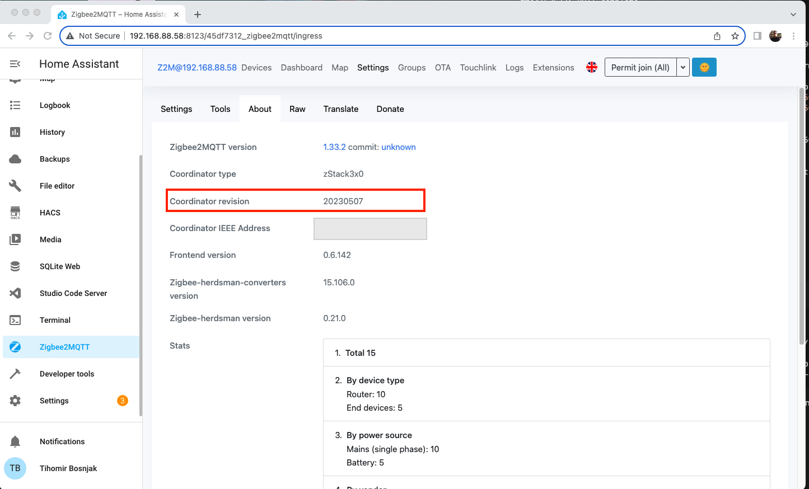

# How to install Home Assistant on Tanix TX9 Pro

## Reissuing Let's Encrypt TLS Certificate

## ZigBee2MQQT

### Installation

Installation is done following the official documentation from [Official Zigbee2MQTT Home Assistant addon](https://github.com/zigbee2mqtt/hassio-zigbee2mqtt#installation).

### Backup of paired devices in the ZigBee network

To make a backup of your network the following steps are to be followed:

1. Stop ZigBee2MQTT. To do so you have to go `Settings -> Add-ons -> Zigbee2MQTT`, click on the `STOP` button and wait until the Add-on is fully stopped.
2. SSH to the server where HA is running `ssh username@YOUR_HA_IP`
3. Using docker enter into main HA container `sudo docker exec -it homeassistant bash`
4. Change directory to `/root` executing `cd /root`
5. Execute the backup `python3 -m zigpy_znp.tools.network_backup /dev/ttyUSB0 -o network_backup.json`. Change the path to the device if no using `/dev/ttyUSB0`
6. Verify the file exist

    ```bash
        $ ls -l network_backup.json
        -rw-r--r--    1 root     root             0 Nov 13 21:53 network_backup.json
    ```

7. Exit the HA container by executing `exit`
8. Copy the backup file to the server running HA `sudo docker exec -it homeassistant bash -c "cat /root/network_backup.json" > network_backup.json`

And now you should have the backup of your network on you machine running HA. This backup will work only with the same ZigBee coordinator used to pair device in the network.

## Flash ZigBee Coordinator

To flash the ZigBee Coordinator you first have to stop anything using it. In the case of using ZigBee2MQTT and `SONOFF Zigbee 3.0 USB Dongle Plus ZigBee 3.x.0 TI CC2652P + CP2102N Coordinator` you  can follow the next step to flash your ZigBee Coordinator.

1. Stop ZigBee2MQTT. To do so you have to go `Settings -> Add-ons -> Zigbee2MQTT`, click on the `STOP` button and wait until the Add-on is fully stopped.
2. Find the appropriate firmware and save the URL to it. Here will be used the latest firmware from [Koenkk/Z-Stack-firmware](https://github.com/Koenkk/Z-Stack-firmware/tree/master/coordinator/Z-Stack_3.x.0/bin). ATM it is [CC1352P2_CC2652P_launchpad_coordinator_20230507.zip](https://github.com/Koenkk/Z-Stack-firmware/blob/master/coordinator/Z-Stack_3.x.0/bin/CC1352P2_CC2652P_launchpad_coordinator_20230507.zip)
3. SSH to the server where HA is running `ssh username@YOUR_HA_IP`
4. Using docker execute the flash command:

    ```bash
        username@cb:~$ sudo docker run --rm \
            --device /dev/ttyUSB0:/dev/ttyUSB0 \
            -e FIRMWARE_URL=https://github.com/Koenkk/Z-Stack-firmware/raw/Z-Stack_3.x.0_coordinator_20230507/coordinator/Z-Stack_3.x.0/bin/CC1352P2_CC2652P_launchpad_coordinator_20230507.zip \
            ckware/ti-cc-tool -ewv -p /dev/ttyUSB0 --bootloader-sonoff-usb

        Unable to find image 'ckware/ti-cc-tool:latest' locally
        latest: Pulling from ckware/ti-cc-tool
        261da4162673: Pull complete
        507a68f54c5a: Pull complete
        8bdc970eb54e: Pull complete
        4f4fb700ef54: Pull complete
        Digest: sha256:7f4d3c6ea6e0d65517da9267f76d22bf468c9e5bcc4efcb96f3f99fcd4980cd0
        Status: Downloaded newer image for ckware/ti-cc-tool:latest
        Downloading firmware from https://github.com/Koenkk/Z-Stack-firmware/raw/Z-Stack_3.x.0_coordinator_20230507/coordinator/Z-Stack_3.x.0/bin/CC1352P2_CC2652P_launchpad_coordinator_20230507.zip
        Firmware source: 'CC1352P2_CC2652P_launchpad_coordinator_20230507.zip'
        Firmware file:   'CC1352P2_CC2652P_launchpad_coordinator_20230507.hex'
        sonoff
        Opening port /dev/ttyUSB0, baud 500000
        Reading data from CC1352P2_CC2652P_launchpad_coordinator_20230507.hex
        Your firmware looks like an Intel Hex file
        Connecting to target...
        CC1350 PG2.0 (7x7mm): 352KB Flash, 20KB SRAM, CCFG.BL_CONFIG at 0x00057FD8
        Primary IEEE Address: 00:12:4B:00:24:CA:7C:0D
            Performing mass erase
        Erasing all main bank flash sectors
            Erase done
        Writing 360448 bytes starting at address 0x00000000
        Write 104 bytes at 0x00057F988
            Write done
        Verifying by comparing CRC32 calculations.
            Verified (match: 0xe83aa727)
    ```

    Just to have the above listing a bit cleaner here is onl the command to be executed:

    ```bash
        sudo docker run --rm \
            --device /dev/ttyUSB0:/dev/ttyUSB0 \
            -e FIRMWARE_URL=https://github.com/Koenkk/Z-Stack-firmware/raw/Z-Stack_3.x.0_coordinator_20230507/coordinator/Z-Stack_3.x.0/bin/CC1352P2_CC2652P_launchpad_coordinator_20230507.zip \
            ckware/ti-cc-tool -ewv -p /dev/ttyUSB0 --bootloader-sonoff-usb
    ```

5. Restart your ZigBee2MQTT by going  `Settings -> Add-ons -> Zigbee2MQTT`, click on the `START` button and wait until the Add-on is fully started.
6. Verify that everything is working.
7. Check the coordinator by going to `Zigbee2MQTT -> Settings -> About`

    